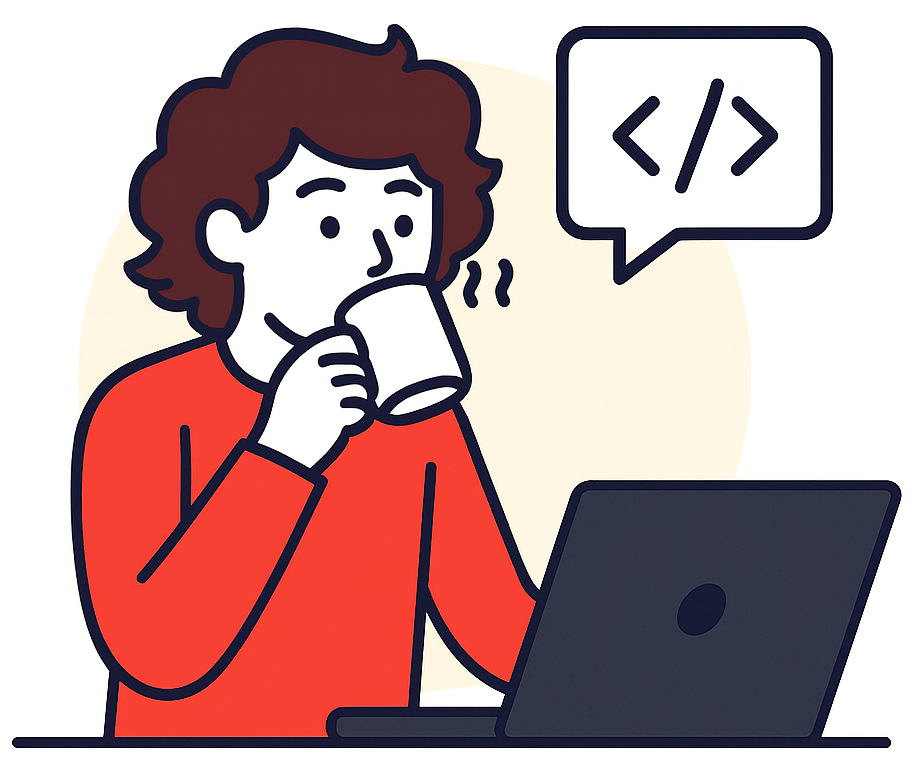

<h3 align="center">👋Hola 👨‍💻Soy Yesua Ibáñez Castrillo 💻 Desarrollador web</h3>

Recién titulado en Desarrollo de Aplicaciones Web, apasionado por crear aplicaciones modernas y eficientes.

 

<h2 align="center">✉️ Contacto</h2>

  

###

<h2 align="center">🔧 Y estas son mis habilidades:</h2>

###

  
  
  
  
  
  
  
  
  
  
  
   
   
  
  
  
  
  
  
  
  
  
  
  
  

###

  
  

